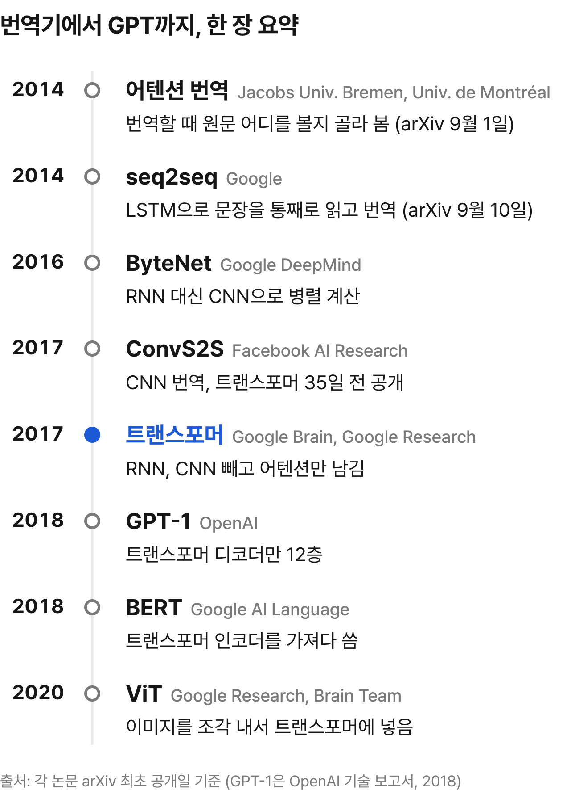

# GPT의 T는 원래 번역기 부품이었음

논문: [Attention Is All You Need](https://arxiv.org/abs/1706.03762)
저자: 구글에서 작업한 8명 <!-- P1 F8 -->
발표: NIPS 2017, arXiv 2017년 6월 <!-- F2 F26 -->

---

GPT는 설명 생략함
다들 아니까

근데 GPT가 뭐의 약자인지
바로 말할 수 있음?

풀네임은
Generative Pre-trained Transformer임 <!-- L10 -->
GPT-4 기술 보고서 초록에도
"트랜스포머 기반 모델"이라고 박혀 있음 <!-- L11 -->

이 T, 트랜스포머는
2017년 구글 논문 한 편에서 나옴 <!-- F1 L12 -->
근데 그 논문이 만들려던 건
챗봇이 아니라 번역기였음 <!-- F18 F23 -->

---

그때 이 논문이 내세운 성과는 이 정도였음

영어-독일어 번역 점수 BLEU를
기존 최고 기록보다 2점 넘게 올림 <!-- F18 -->
학습은 GPU 8장 달린 서버 한 대로 끝냄 <!-- F16 -->
결론에 적은 다음 계획은
이미지, 오디오, 비디오로 넓혀보겠다는 것이었음 <!-- F20 -->

그리고 지금은 이렇게 됐음
피인용 약 19만 회 <!-- L7 -->
(Semantic Scholar, 2026년 9월 기준)
저자 8명 중 7명은 2024년 3월 기준
AI 회사 공동창업자가 돼 있었음 <!-- W1 -->

번역 점수 2점 넘게 올린 번역기 부품이
GPT의 T가 된 거임

그럼 어쩌다 이렇게 됐냐
답은 GPT-1 보고서에 적혀 있음
뒤에서 공개함 <!-- L21 -->

계보부터 한 장으로 보면 이럼

 <!-- L1 L2 L3 L4 L12 L5 L6 L20 -->

---

계보 맨 위, 2014년부터 보면 됨

2014년
구글의 Sutskever, Vinyals, Le가
LSTM이라는 신경망으로 번역기를 만듦 <!-- L1 P2 -->

A B C를 끝까지 다 읽고
그다음에 W X Y Z를 뱉는 구조임 <!-- L15 -->
논문 제목을 따서 seq2seq라고 부름 <!-- L1 -->

쉽게 말하면
문장을 통째로 외운 다음에 번역함

정확히는
입력 문장 전체를 정해진 크기의 숫자 묶음(벡터) 하나로 압축하고
그 벡터에서 번역문을 풀어냄 <!-- L1 -->
읽는 쪽을 인코더, 풀어내는 쪽을 디코더라고 부름

참고로 Sutskever란 이름 기억해두셈
맨 뒤에서 다시 나옴

---

이 LSTM은 RNN(순환 신경망)이라는 계열임
단어를 앞에서부터 하나씩 읽는 구조임
근데 RNN엔 고질병이 두 개 있음

**① 줄 서서 계산함**
앞 단어 계산이 끝나야 다음 단어로 넘어감
그래서 한 문장 안에선 병렬로 못 돌림 <!-- F9 -->
비유하면 이어달리기임
앞 주자한테 바통을 받아야 다음 주자가 뜀

**② 먼 단어끼리 잘 못 이음**
첫 단어와 끝 단어를 이으려면
사이에 있는 단어를 전부 거쳐야 함 <!-- F15 F34 -->
비유하면 귓속말 전달 게임임
사람이 많을수록 끝까지 잘 안 감

이 두 개만 기억하면
이 글 끝까지 따라올 수 있음

---

그중 ②를 두고 먼저 주장이 엇갈림
긴 문장을 벡터 하나에 담으면
앞쪽 단어가 끝까지 잘 가냐는 문제임

seq2seq 팀은
입력 문장을 거꾸로 뒤집어 넣는 트릭을 씀
그러면 원문 첫 단어와 번역문 첫 단어가 가까워져서
학습이 훨씬 쉬워진다고 함 <!-- L28 -->
그랬더니 긴 문장도 별 문제 없었다고 함 <!-- L17 -->

반대로 Bahdanau, 조경현, Bengio 쪽은
문장을 벡터 하나에 다 욱여넣으면
긴 문장에서 병목일 수 있다고 봄 <!-- L13 -->
조경현 팀의 다른 연구(Cho 외 2014)에서
문장이 길어질수록
성능이 급하게 떨어졌다는 걸 근거로 듦 <!-- L13 -->

순서로 보면 seq2seq가 먼저 나오고
Bahdanau 쪽이 그걸 고친 것 같지만
논문 사전 공개 사이트 arXiv엔
Bahdanau 쪽 논문이 9일 먼저 올라왔음 <!-- L20 -->
사실상 같은 때 나온 두 답이었음

그리고 이쪽이 내놓은 해법이
나중에 판을 통째로 바꿈

---

그 해법은 이거였음
번역 단어를 하나 뽑을 때마다 원문을 다시 흘끗 봄
어디를 볼지는 그때그때 모델이 고름 <!-- L2 -->
이게 번역에 붙은 어텐션(attention)임

아래가 그 결과임
가로가 영어 원문, 세로가 프랑스어 번역
밝은 칸일수록 그 단어를 많이 봤다는 뜻 <!-- L14 -->
보통은 대각선으로 쭉 내려감

European Economic Area가 프랑스어론
zone économique européenne로 순서가 뒤집히는데
그 구간만 대각선이 거꾸로 꺾여 있음 <!-- L30 -->
어텐션이 뒤집힌 순서를 제대로 짚어냄 <!-- L14 -->

근데 ①은 그대로였음
어텐션을 RNN 위에 얹은 거라
줄 서서 계산하는 건 안 바뀜 <!-- F10 -->

---

그럼 RNN을 아예 딴 걸로 바꾸면 되는 거 아님? 싶었는데
실제로 그런 팀들이 나옴

2016년 구글 딥마인드 ByteNet
2017년 페이스북 AI 리서치 ConvS2S <!-- L3 L4 -->

둘 다 CNN(합성곱 신경망)이라
문장 전체를 한 번에 병렬로 계산함 <!-- F11 -->
대신 층 하나는 가까운 몇 단어만 이어줌 <!-- F56 -->
그래서 먼 단어를 이으려면 층을 쌓아야 함
①은 해결

②도 RNN보다 나아졌다고 내세움
먼 단어까지 가는 경로를 줄였다고 함 <!-- L24 L25 -->

근데 두 단어 사이 거리가 2배가 되면
ConvS2S는 필요한 층도 2배로 늘어남 <!-- F11 F34 -->
ByteNet은 층마다 보는 간격을 두 배씩 넓혀둬서
층을 조금만 더 쌓으면 됨 <!-- L29 F11 -->

표 오른쪽 두 칸이 기다리는 단계와 먼 단어까지 칸 수임 <!-- F34 F53 -->

 <!-- F34 F15 F53 -->

문장 길이를 n이라고 하면 <!-- F53 -->
RNN은 n단계를 줄 서서 기다리고 먼 단어까지 n칸
CNN은 기다림은 1단계인데 먼 단어까지 여러 칸
둘 다 1인 건 곧 나올 셀프 어텐션뿐임 <!-- F34 -->
대신 층 하나 계산량이 n²에 비례함 <!-- F15 -->
이 n²은 뒤에서 다시 나옴

---

그러다 ConvS2S가 arXiv에 올라오고 35일 뒤
구글에서 이 논문이 올라옴 <!-- L4 F26 -->

제목부터 도발적임
어텐션만 있으면 된다는 뜻임
비틀스 노래 "All You Need Is Love"를 비튼 거라고 함 <!-- W3 -->
위키백과가 Wired 기사를 인용해 정리한 내용임

주장은 간단함
RNN도 CNN도 빼고 어텐션만 남김 <!-- F1 -->
그래서 병렬화가 잘 되고 <!-- F50 -->
먼 단어끼리도 거리와 상관없이 한 단계로 이어짐 <!-- F12 -->

①과 ②를 한 번에 잡겠다고 나섰음
단, ①은 학습할 때 얘기임
학습할 땐 정답 번역문을 이미 알고 있어서
통째로 넣고 한꺼번에 계산함 <!-- F55 F50 -->
실제로 번역할 땐 정답이 없으니
여전히 한 단어씩 뽑아야 함 <!-- F51 -->

어떻게 잡았는지 보기 전에
이걸 만든 8명부터 보고 감

---

그 8명 얘기는 첫 페이지 각주에 다 있음

8명 전원 동등 기여고
저자 순서는 무작위라고 박아둠 <!-- F4 -->
이 논문은 보통 "Vaswani et al. (2017)"로 인용됨
나중에 나온 BERT 논문도 그렇게 씀 <!-- L5 -->
근데 그 맨 앞 이름도 무작위로 정해진 거였음 <!-- F4 -->

누가 뭘 했는지도 밝혀둠
RNN을 셀프 어텐션으로 바꾸자고 한 건 Uszkoreit <!-- F5 -->
스케일드 닷프로덕트, 멀티헤드,
위치 표현 방식은 Shazeer가 제안함 <!-- F6 -->
셋 다 뒤에서 하나씩 나옴
첫 구현은 Vaswani와 Polosukhin <!-- F7 -->

감사의 글도 볼 만함
앞에서 나온 ByteNet 기억남?
구글 딥마인드가 CNN으로 만든 번역기였고 <!-- L3 -->
이 논문 결과 표에선 트랜스포머한테 진 비교 대상임 <!-- L3 F17 -->

근데 감사의 글에 그 ByteNet 제1저자
Nal Kalchbrenner 이름이 있음
코멘트와 수정, 그리고 영감을 줘서 고맙다고 함 <!-- F21 -->
표에선 이긴 상대인데
감사의 글에선 영감을 받았다고 인사함

---

이제 본론, 셀프 어텐션임

쉽게 말하면
RNN은 이어달리기처럼 바통을 넘겼음
트랜스포머에선 모든 단어가
다른 모든 단어를 동시에 쳐다봄
이게 셀프 어텐션(self-attention)임

정확히는
원문을 읽는 인코더에선 모든 단어가 서로를 보고 <!-- F41 -->
번역문을 뽑는 디코더 쪽은
아직 안 나온 뒤 단어를 못 보게 가려둠 <!-- F35 -->
학습 땐 정답을 통째로 넣어주니까
뒤를 가리지 않으면 답을 보고 베끼게 됨 <!-- F55 -->

진짜 그렇게 보는지 논문 부록에 증거가 있음
"The Law will never be perfect,
but its application should be just"
its에서 선이 어디로 뻗는지 보셈 <!-- F32 -->

Law와 application으로 딱 붙음 <!-- F32 -->
선 색이 두 개인데, 어텐션을 여러 갈래로 나눠 돌린 것 중 두 갈래임
하나는 Law, 하나는 application 쪽을 봄 <!-- F54 -->
갈래 얘기는 뒤에서 다시 나옴
논문은 대명사 풀이에 관여하는 것 같다고 조심스럽게 씀 <!-- F32 -->

---

그럼 이걸로 ②가 풀렸냐 하면
이건 실험보다 설계가 먼저 보장함
어떤 두 단어든 한 단계로 이어지게 짰으니까 <!-- F12 F15 -->
부록 그림은 그걸 눈으로 보여주는 예시임

"making the registration
or voting process more difficult"
making과 more difficult 사이에
단어가 다섯 개 끼어 있음 <!-- F31 -->

귓속말 게임이면 다섯 명을 거쳐야 함
층을 여섯 개 쌓는데 그중 다섯 번째 층에서
어텐션이 이걸 바로 이어버림 <!-- F31 -->

여기서도 색이 다른 선은 서로 다른 갈래임 <!-- F31 -->
논문은 갈래마다 다른 일을
확실히(clearly) 배웠다고 씀 <!-- F33 -->

---

이 파트 하나는 전문가용임
수식 싫으면 다음 파트로 넘겨도 됨

단어가 다른 단어를 쳐다본다는 걸
계산으로 쓰면 이 한 줄임

말로 풀면 세 단계임
쿼리(Q)는 지금 단어가 찾는 것
키(K)는 각 단어에 붙은 이름표
값(V)은 실제로 가져올 내용
쿼리와 키를 곱해서 짝이 맞는 정도를 점수로 냄
softmax로 점수를 비율로 바꿈
그 비율대로 값(V)을 섞어서 가져옴 <!-- F27 -->

√d_k로 나눠서 크기를 줄이는 게
이름에 붙은 "스케일드"임 <!-- F57 -->

√d_k로는 왜 나눔?
차원이 크면 곱한 값이 너무 커져서
softmax 기울기가 거의 0이 됨
그걸 막으려고 나눔 <!-- F28 -->
저자들도 "그럴 거라고 본다(suspect)"고 밝힘 <!-- F28 -->

---

이제 앞에서 미뤄둔 갈래 얘기임
멀티헤드는 왜 필요하냐면
어텐션 결과는 여러 단어를 비율대로 섞은 평균임 <!-- F27 -->
한 번에 다 섞으면 흐려질 수 있음 <!-- F12 -->
앞의 its 그림에서 선 색이 두 개였던 거 기억남?
그게 서로 다른 갈래 두 개였음 <!-- F32 F54 -->
이 갈래를 헤드라고 부름
갈래를 나눠 따로 보게 해서 흐려지는 걸 보완함 <!-- F12 -->
단어 하나를 나타내는 숫자 512개를
8갈래로 나눠 갈래마다 64개씩 씀 <!-- F40 F30 -->
그래서 전체 계산량은 한 갈래일 때랑 비슷함 <!-- F30 -->
왼쪽이 어텐션 한 번, 오른쪽이 그걸 여러 갈래로 돌리는 멀티헤드임

근데 여기서 문제가 하나 있음
모든 단어를 한꺼번에 보니까
어느 단어가 앞이고 뒤인지 알 길이 없음 <!-- F13 -->
그래서 단어마다 위치를 알려주는
사인파 모양의 값을 더해줌 (위치 인코딩) <!-- F13 -->
사인파를 고른 건 학습 때보다 긴 문장에도
통할 수 있을 것 같아서라고 함 <!-- F42 -->

---

멀티헤드와 위치 인코딩까지 다 조립하면 이렇게 생김

트랜스포머 안에서 단어 하나는
숫자 512개짜리 묶음으로 다뤄짐 <!-- F40 -->
인코더, 디코더 각각 같은 층을 6개씩 쌓음 <!-- F24 -->
층 하나엔 어텐션 다음에
단어마다 작은 신경망이 붙는데
512개를 2048개로 넓혔다가 다시 512개로 줄임 <!-- F40 -->
층을 지날 때마다 입력을 출력에 다시 더해주고
값의 크기를 고르게 맞춤 (잔차 연결, 레이어 정규화) <!-- F39 -->

어텐션은 세 군데서 씀 <!-- F41 -->
인코더 단어끼리 볼 때
디코더 단어끼리 볼 때, 이때는 뒤 단어를 가림
그리고 디코더가 인코더를 볼 때

---

그럼 이걸 뭘로 얼마나 학습시켰냐면

학습 데이터는
영어-독일어 약 450만 문장 쌍
영어-프랑스어 3600만 문장 <!-- F36 -->

이걸 P100 GPU 8장 달린 서버 1대로 돌림
기본 모델 12시간, 큰 모델 3.5일 <!-- F16 -->
논문은 12시간 만에 번역 최고 기록 수준까지 간다고 씀 <!-- F50 -->
병렬화 덕에 학습이 빨라졌다는 게 저자들 주장임 <!-- F50 -->

레시피도 적혀 있음
한 번에 배우는 보폭(학습률)을
처음 4000번 반복까지는 키우고
그 뒤로는 서서히 줄임 <!-- F37 -->

여기서 반전 하나
보통 학습은 정답 단어에 확률을 몰아주도록 시킴
근데 이 논문은 레이블 스무딩이란 걸로
정답에 너무 확신하지 말라고 일부러 가르침 <!-- F38 -->

그러니 정답 단어에 몰아주는 확률이 줄어들고
그 확률로 매기는 퍼플렉서티 점수는 나빠짐 <!-- F38 -->
근데 실제 번역 정확도와 BLEU는 오히려 오름 <!-- F38 -->
덜 확신하게 배운 모델이 번역은 더 잘한 거임

---

그래서 결과는 어땠냐면
BLEU가 뭔지부터 짚고 감
기계 번역이 사람 번역에 얼마나 가까운지
자동으로 재는 점수임. 높을수록 좋음 <!-- L23 -->

WMT 2014 영어-독일어에서
큰 모델이 BLEU 28.4를 찍음 <!-- F17 -->
여러 모델을 합친 앙상블까지 포함한 기존 최고보다
2.0 BLEU 넘게 높았다고 함 <!-- F18 -->
영어-프랑스어는 단일 모델 41.8 <!-- F17 F19 -->

표 맨 아래 두 줄이 트랜스포머임
작은 기본 모델도 영어-독일어 27.3으로
기존 모델을 전부 넘었는데
학습 비용은 표에서 제일 적었음 <!-- F25 -->

---

근데 점수표보다 볼 만한 게 Table 3임
부품을 하나씩 바꿔가며 점수를 잼
영어-독일어 개발 세트 기준이고
기본 모델은 BLEU 25.8임 <!-- F43 F44 -->
앞의 27.3은 시험용 문제로 잰 점수고
이건 연습용 문제로 잰 점수라
직접 비교하지 않음 <!-- F43 F52 -->

헤드 1개로 줄이면 24.9 <!-- F44 -->
그럼 많을수록 좋냐 하면
32개로 늘려도 25.4로 떨어짐 <!-- F44 -->
계산량을 고정해서 갈래가 많을수록 갈래마다 숫자 폭이 좁아짐 <!-- F52 -->
폭을 줄이면 점수가 떨어진다는 것도 같은 표에 있음
단어끼리 얼마나 맞는지 점수 매기는 일이
생각보다 어려워서라고 봄 <!-- F49 -->
적당히가 최고였음

학습할 때 일부 신경을 일부러 꺼두는
드롭아웃을 빼면 24.6까지 떨어짐 <!-- F45 -->
학습 데이터를 외워버리는 걸 막아준다고 함 <!-- F45 -->
층을 2개로 줄이면 23.7 <!-- F47 -->

사인파 대신 위치 값도 학습으로 배우게 바꿔봤는데
25.7로 거의 같았음 <!-- F46 -->

---

그럼 고질병 두 개 다 잡았으니 이제 끝임?
아님. 셀프 어텐션이 새로 만든 게 하나 있음

모든 단어가 모든 단어를 보니까
층 하나 계산량이 문장 길이의 제곱에 비례함 <!-- F15 -->
문장이 2배 길어지면 이 부분은 4배가 됨

층 하나 계산량을 비교하면
RNN은 문장 길이 × 512²
셀프 어텐션은 문장 길이² × 512에 비례함 <!-- F34 F40 -->
그래서 문장 길이가 512보다 짧으면
셀프 어텐션 쪽이 적다고 논문이 조건을 달아둠 <!-- F14 -->
번역 문장은 대개 여기 들어간다고 함 <!-- F14 -->

저자들도 알고 있었음
이미지, 오디오, 비디오처럼 입력이 큰 데이터용으로
일부만 보는 어텐션을 연구하겠다고 적어둠 <!-- F20 -->
번역문을 한 단어씩 뽑는 것도 덜 순차적으로 만들겠다고 함 <!-- F20 F51 -->

이 대가가 대표적으로 문제가 된 곳이 이미지임

---

이미지에 셀프 어텐션을 그대로 쓰면
픽셀마다 다른 모든 픽셀을 봐야 함
비용이 픽셀 수의 제곱이라 감당이 안 된다고 함 <!-- L22 -->
앞에서 말한 n² 대가임

그래서 2018년 원저자 5명이 낀 팀은
픽셀마다 주변만 보게 해봄 (Image Transformer) <!-- L9 -->

2020년 ViT는 다른 길을 감
이미지를 작은 조각으로 잘라서
조각 하나를 단어 하나처럼 넣음 <!-- L6 L16 -->
조각 수를 줄였을 뿐 n² 구조가 사라진 건 아님
이미지가 커지면 비용이 빠르게 는다고 ViT도 적어둠 <!-- L26 -->

그리고 원래 트랜스포머를 최대한 그대로 따랐다고 적음 <!-- L6 -->

---

트랜스포머가 이미지까지 퍼지는 동안
만든 8명은 어떻게 됐냐면
맨 앞에서 8명 중 7명이 공동창업자라고 했음

2024년 3월 엔비디아 GTC 행사 기준으로
8명 전원 구글 밖에 있었음 <!-- W1 -->
공동창업자 7명은 이럼
Shazeer는 Character.ai, Gomez는 Cohere
Vaswani와 Parmar는 Essential AI
Jones는 Sakana AI, Uszkoreit은 Inceptive
Polosukhin은 NEAR Protocol <!-- W1 -->
나머지 1명 Kaiser는 OpenAI 연구원이었음 <!-- W1 -->

그 행사 무대엔 Parmar를 뺀 7명이 모였고 <!-- W1 -->
거기서 Gomez가 이런 말을 함
"세상엔 트랜스포머보다 나은 게 필요하다" <!-- W2 -->

번역기 부품 만든 사람이
다음 부품이 나와야 한다고 말한 셈임

이후로도 이동이 있어서
지금 소속은 그때와 다를 수 있음

---

다시 2018년으로 돌아가서
맨 앞에서 미뤄둔 답을 공개함

2018년
OpenAI가 GPT-1 보고서를 냄 <!-- L12 -->
트랜스포머에서 디코더만 12층 쌓음 <!-- L12 -->

왜 RNN 말고 이걸 골랐냐면
보고서에 이유가 두 개 적혀 있음 <!-- L21 -->
하나는 번역, 문서 생성, 구문 분석에서
이미 성능이 검증됐다는 것
다른 하나는 RNN 같은 대안보다
긴 의존 관계를 다루는 구조화된 기억을 준다는 것

두 번째가 ②와 통하는 얘기임
귓속말 게임을 덜 해도 되는 구조임

디코더만 쓰는 방식은
다른 논문(Liu 외 2018)의 변형을 따랐다고 함
그 논문 저자에 Kaiser, Shazeer가 있음 <!-- L19 -->

그리고 GPT-1 저자 목록 맨 끝에 Ilya Sutskever가 있음
2014년 seq2seq 제1저자 그 사람임
메일 아이디도 ilyasu로 같음 <!-- P2 -->
RNN 번역기를 만들던 사람이
4년 뒤 트랜스포머 기반 GPT-1에 이름을 올림 <!-- P2 L1 L12 -->

---

처음 질문으로 돌아감
GPT의 T는 트랜스포머임 <!-- L10 -->
근데 이제 더 정확히 말할 수 있음

2017년 트랜스포머는 두 쪽이었음
원문을 읽는 인코더
번역문을 한 단어씩 뽑는 디코더 <!-- F24 F51 -->

인코더 쪽은 BERT가 거의 그대로 가져갔고 <!-- L5 -->
GPT는 인코더 없이 디코더 쪽만 쌓았음 <!-- L12 L19 -->
BERT 논문이 둘을 나란히 그려둠

BERT는 문장의 앞뒤를 다 보고
GPT는 앞쪽만 보고 다음을 씀 <!-- L10 L27 -->

GPT-4 보고서도 스스로를
다음 토큰, 그러니까 다음 단어 조각을 예측하는
트랜스포머 기반 모델이라고 소개함 <!-- L11 -->
2017년 디코더가 번역문을 한 단어씩 뽑던 것과 같은 원리임 <!-- F51 L11 -->

영어를 독일어로 옮기던 번역기에서
번역문을 뽑던 그 쪽이
이제 번역 말고 글 자체를 뽑고 있음 <!-- L11 L27 -->

이게 GPT의 T임

그리고 그 글은 이제 코드까지 감

---

말로 시키면 AI가 코드를 짜주는 걸
바이브코딩이라고 부름 <!-- W4 -->
Andrej Karpathy가 만든 말인데
콜린스 사전이 2025년 올해의 단어로 뽑았음 <!-- W4 -->
그런 AI 중 하나인 GPT-4는
보고서에 스스로를 트랜스포머 기반이라고 적음 <!-- L11 -->

번역 점수 2점 올렸다고 발표한 부품에서 시작해서 <!-- F18 -->
사전에 새 단어가 올라가는 데까지 온 거임

맨 앞의 이어달리기랑 귓속말 게임 기억남?
바통을 안 기다리니 학습을 한꺼번에 돌릴 수 있었고 <!-- F50 -->
귓속말을 안 거치니 긴 글의 먼 앞뒤를 바로 이어봄 <!-- F12 L21 -->

근데 끝난 얘기는 아님
n² 비용은 구조에 그대로 남아 있고 <!-- F15 -->
긴 입력을 일부만 보는 어텐션, 덜 순차적인 생성은
저자들이 2017년 결론에 적어둔 숙제였음 <!-- F20 -->
만든 사람조차 트랜스포머보다 나은 게 필요하다고 했으니 <!-- W2 -->
이 숙제를 누가 먼저 푸느냐가 다음 관전 포인트임

**3줄 요약**
GPT의 T는 2017년 구글 번역 논문이 내놓은 트랜스포머임 <!-- L10 L12 F1 -->
RNN 없이 어텐션 중심으로 먼 단어를 한 번에 잇고, n² 비용을 치름 <!-- F1 F12 F15 -->
번역문을 뽑던 디코더 쪽이 GPT가 됐고, 바이브코딩까지 이어짐 <!-- L12 L11 W4 -->

---

출처

- 원 논문: [Attention Is All You Need (arXiv:1706.03762)](https://arxiv.org/abs/1706.03762)
- 2002 [BLEU: a Method for Automatic Evaluation of Machine Translation](https://aclanthology.org/P02-1040/)
- 2014 [Sequence to Sequence Learning with Neural Networks](https://arxiv.org/abs/1409.3215)
- 2014 [Neural Machine Translation by Jointly Learning to Align and Translate](https://arxiv.org/abs/1409.0473)
- 2016 [Neural Machine Translation in Linear Time (ByteNet)](https://arxiv.org/abs/1610.10099)
- 2017 [Convolutional Sequence to Sequence Learning (ConvS2S)](https://arxiv.org/abs/1705.03122)
- 2018 [Improving Language Understanding by Generative Pre-Training (GPT-1)](https://cdn.openai.com/research-covers/language-unsupervised/language_understanding_paper.pdf)
- 2018 [BERT](https://arxiv.org/abs/1810.04805)
- 2020 [An Image is Worth 16x16 Words (ViT)](https://arxiv.org/abs/2010.11929)
- 2023 [GPT-4 Technical Report](https://arxiv.org/abs/2303.08774)
- [VentureBeat, 2024-03-20, GTC 패널 기사](https://venturebeat.com/ai/attention-is-all-you-need-creators-look-beyond-transformers-at-nvidia-gtc-the-world-needs-something-better)
- [Wikipedia: Attention Is All You Need](https://en.wikipedia.org/wiki/Attention_Is_All_You_Need)
- 피인용 수: Semantic Scholar API, 2026-09-28 조회

---

내용 추가하면

√d_k로 나누는 이유를 조금 더 파면
q와 k의 각 성분이 서로 독립이고
평균 0, 분산 1이라고 치면
둘을 곱해 더한 값은 분산이 d_k가 됨 <!-- F29 -->
원문 설명은 여기까지임
계산을 이어가 보면 √d_k로 나눈 값은 분산이 1이 됨
여기부터는 원문에 없는 계산임 <!-- F29 -->

그리고 영어-프랑스어 점수가
초록과 표엔 41.8, 본문 6.1절엔 41.0으로 적혀 있음 <!-- F19 -->
7번째 버전에도 그대로 남아 있음 <!-- F19 -->
